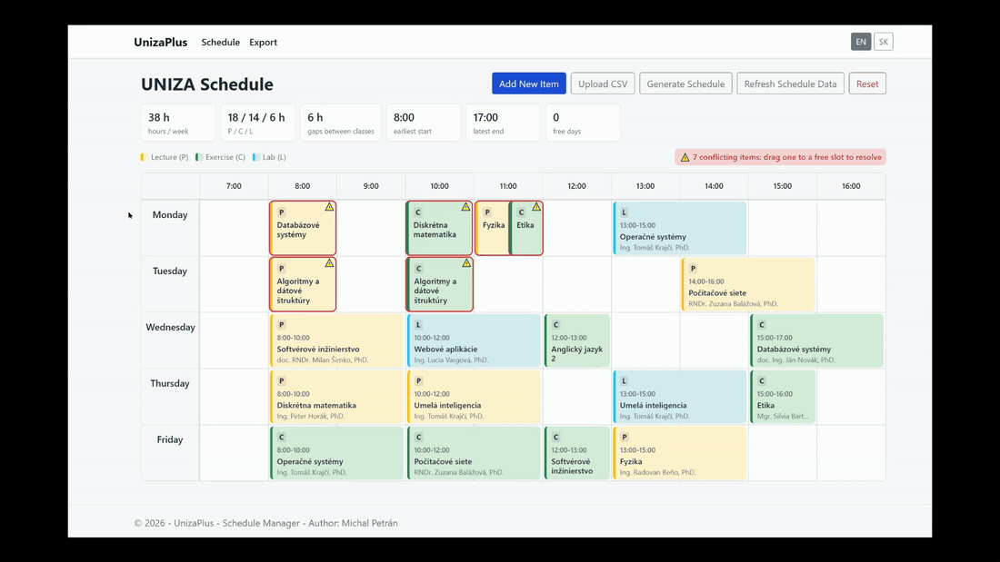
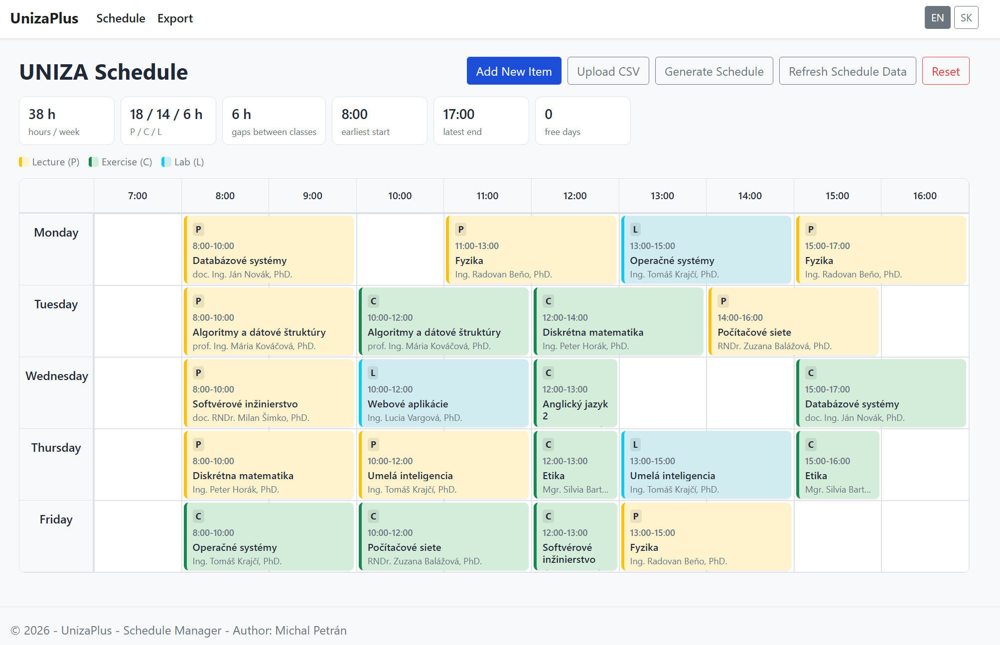
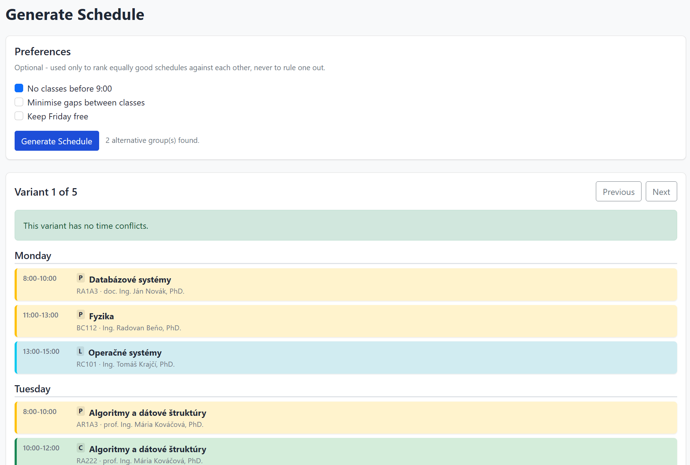
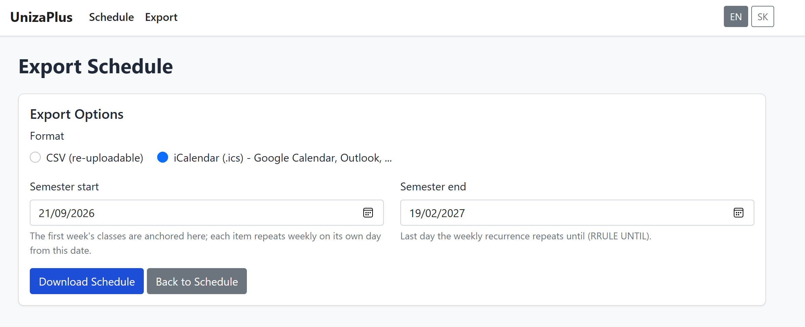
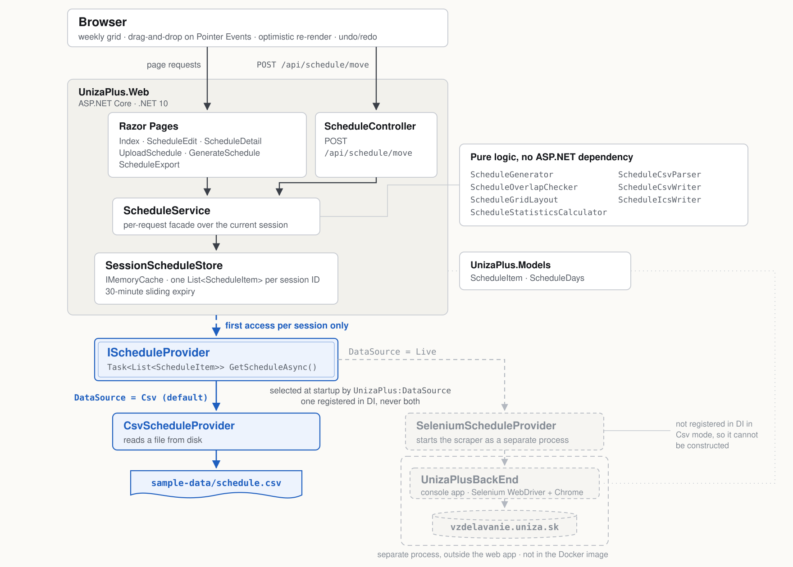

**English** | [Slovenčina](README.sk.md)

# UnizaPlus

A personal timetable for University of Žilina students: somewhere to keep the schedule you actually attend once it stops matching the one the university generated in September. An ASP.NET Core Razor Pages application on .NET 10.

[](https://github.com/Miclah/UnizaPlus/actions/workflows/ci.yml)
[](LICENSE)

## Contents

- [Live demo](#live-demo)
- [About this project](#about-this-project)
- [Features](#features)
- [Screenshots](#screenshots)
- [Tech stack](#tech-stack)
- [Architecture](#architecture)
- [CSV mode](#csv-mode)
- [Running locally](#running-locally)
- [Tests](#tests)
- [Configuration](#configuration)
- [Deployment](#deployment)
- [Uninstalling](#uninstalling)
- [License](#license)
- [Author](#author)

## Live demo

**[miclah-unizaplus.azurewebsites.net](https://miclah-unizaplus.azurewebsites.net)**

There is nothing to log into. The first page is the timetable itself, loaded from a sample schedule that ships with the application, and every visitor gets a private copy of it. Drag a class to a different slot, add one, generate an alternative arrangement or export the result, and none of it reaches anyone else.

It runs on the free Azure App Service tier, which has no Always On, so the site goes to sleep after about half an hour without visitors. The first request after that has to start it back up and will take a moment. There is no database to wake alongside it, so the wait is short and everything after it is immediate.



## About this project

At the start of every semester the university system at `vzdelavanie.uniza.sk` generates a timetable from your study group and publishes it. That is what it is for, and it does it once.

What happens next is the part it does not cover. An exercise gets moved to a different slot, a lab swaps with another group, a subject settles into a room that is not the one on the original plan. Those changes are agreed in the first weeks and then hold for the rest of the semester, but the portal keeps showing the version it generated back in September. There is nowhere to record the correction, so the timetable a student actually attends ends up living somewhere else: in a note, in a phone calendar typed out by hand, or just in their head.

UnizaPlus is that somewhere else, with the difference that it starts from the generated timetable rather than from a blank page. Classes can be moved, added and removed, clashes are flagged as they appear, and the result exports as a CSV file or as an `.ics` calendar covering the semester dates you give it. Where a subject runs several parallel groups, the generator can work out which combination of them collides least.

It was written as a university project. The interface is available in English and Slovak, switched from the header and remembered in a cookie.

## Features

- A weekly grid from 7:00 to 20:00, colour-coded by class type, that trims empty leading and trailing hours so a timetable of morning classes does not render eight blank columns.
- Drag-and-drop rescheduling built on Pointer Events, so mouse, touch and pen all take the same code path. Moves are applied optimistically and persisted in the background, with an undo/redo stack for the whole session.
- Overlap detection. The edit form refuses to save a class into an occupied slot; dragging deliberately allows it and highlights the clash instead, because moving two classes apart usually means putting one of them somewhere invalid first.
- A schedule generator that picks one parallel group per subject to produce a timetable with as few collisions as possible, with optional preferences for avoiding early mornings, minimising gaps and keeping Friday free.
- Statistics above the grid: contact hours by class type, total idle hours between classes, earliest start, latest finish and which days are free.
- Export to CSV, or to an RFC 5545 `.ics` file where each class becomes a weekly recurring event bounded by the semester dates you enter.
- Upload your own CSV to replace the sample data with your real timetable.
- Reset, which restores the bundled sample schedule for your session alone.

## Screenshots

### The weekly grid with statistics


### The generator, showing a conflict-free variant


### Export, with the semester date range for .ics


## Tech stack

| Layer | Technology | Version |
|---|---|---|
| Framework | .NET | 10.0 |
| Web | ASP.NET Core Razor Pages, one API controller for drag-and-drop | 10.0 |
| Front end | Bootstrap | 5.1.0 |
| Drag-and-drop | Plain JavaScript over the Pointer Events API | - |
| Localisation | ASP.NET Core resource files, English and Slovak | 10.0 |
| Scraper | Selenium WebDriver, Selenium.Support (`UnizaPlusBackEnd` only) | 4.46.0 |
| Tests | xUnit with `WebApplicationFactory` | 2.9.3 |
| Test SDK | Microsoft.NET.Test.Sdk | 18.8.1 |
| Hosting | Azure App Service, Linux, F1 Free | - |

There is no database and no ORM anywhere in the solution. Nothing about a timetable that only lives for one browser session needs to survive a restart, so adding persistence would have meant provisioning, migrating and securing a database that never held anything worth keeping.

## Architecture



The solution is four projects. `UnizaPlus.Web` is the application, `UnizaPlus.Models` holds `ScheduleItem` and the day-name handling shared by everything else, `UnizaPlusBackEnd` is a console scraper, and `UnizaPlus.Tests` covers all three.

### Why the data source sits behind an interface

The original version of this project only knew how to get a timetable one way: drive a real Chrome instance through the university portal with Selenium, log in as a student, and read the rendered grid. That works, but it makes the web application unusable to anyone who is not holding UNIZA credentials, and undeployable anywhere without a browser and a network route to the university.

`IScheduleProvider` exists to make the source of a timetable a configuration decision rather than a structural one. It has a single method that returns a list of `ScheduleItem`, and two implementations: `CsvScheduleProvider` reads a file from disk, `SeleniumScheduleProvider` starts the scraper as a separate process and reads back the CSV it writes.

The important part is where the choice is made. `Program.cs` reads `UnizaPlus:DataSource` at startup and registers exactly one of them. In the default `Csv` mode, `SeleniumScheduleProvider` is never added to the service collection at all, so it cannot be resolved, constructed or reached by any code path. That is stronger than an `if` inside a single provider: the scraper is not disabled at runtime, it is absent from the object graph. `UnizaPlus.Web` also does not reference Selenium as a package, directly or transitively, and the Docker image never copies `UnizaPlusBackEnd` into the build context, so the browser automation dependencies do not exist in a deployed container even as dead weight.

The other half of the decision is that both providers only ever produce a *starting point*. Once a session has its timetable, everything after that (drags, edits, uploads, generated variants) happens against the in-memory copy, and the provider is not consulted again unless the visitor asks for a refresh. This is what lets one interface serve two sources that behave nothing alike: a file read that takes a millisecond and a browser session that takes half a minute both happen exactly once per visitor.

The scraper is kept in the repository as the original route to real data, but it cannot be verified without student access to the UNIZA portal.

### Session isolation

`SessionScheduleStore` holds one list of `ScheduleItem` per ASP.NET Core session ID, in `IMemoryCache` with a thirty-minute sliding expiry. There is no login and no account: the session starts on first visit, and the store writes a throwaway key into it so that the session cookie is actually issued, because ASP.NET Core does not send one until something has been stored.

Nothing is written back to disk. A visitor's edits cannot reach the sample CSV file, another visitor, or the next deployment, which is what makes it safe to put a fully editable timetable on a public URL with no authentication in front of it. Abandoned sessions are evicted by the cache rather than accumulating.

### The generator

`ScheduleGenerator` treats the problem as a constraint search. It groups classes that share a subject and class type but belong to different student groups into *blocks* of interchangeable alternatives; anything without a sibling alternative is fixed and cannot move. It then backtracks over one alternative per block, tracking the number of overlapping pairs as it goes.

The search prunes on that running count. Adding a class never removes a conflict, so as soon as a partial assignment has more conflicts than the best complete timetable found so far, the whole branch is abandoned. Blocks with the fewest alternatives are tried first, since those hit a disqualifying conflict earlier and give the pruning something to work with sooner. A hard ceiling of 200,000 visited nodes keeps a pathological input from hanging a request.

Preferences never change which timetables are valid. They only rank ones that tie on conflict count, which is why enabling "free Friday" on a timetable where Friday is unavoidable still returns a result instead of failing.

`ScheduleGenerator`, `ScheduleOverlapChecker`, `ScheduleGridLayout` and `ScheduleStatisticsCalculator` all take plain lists and return plain values, with no ASP.NET dependency, so they are unit tested directly rather than through the web stack.

### Client and server agree on layout

Dragging a class re-renders the grid in the browser without a round trip, which means the JavaScript has to compute overlap groups and column positions itself. That logic is a deliberate one-to-one port of `ScheduleOverlapChecker` and `ScheduleGridLayout`, so an optimistic client-side render and the server's own render of the same data cannot disagree. The move is then posted to `POST /api/schedule/move`, which validates the day and the hour range before committing it to the session.

## CSV mode

`Csv` is the default and the only mode the demo and the Docker image support. It reads `sample-data/schedule.csv`, or whatever `UnizaPlus:CsvPath` points at, and it is also what the "Upload CSV" page accepts.

The header row is required. Only `Subject`, `Type`, `Day`, `Start` and `End` must be present; the rest may be blank.

```
Subject,SubjectCode,Type,Day,Start,End,Room,Teacher,Group
Databázové systémy,6BI0101,P,Monday,8,10,RA1A3,"doc. Ing. Ján Novák, PhD.",FRI22
```

`Type` is `P` for a lecture, `C` for an exercise or `L` for a lab. `Day` accepts English or Slovak names in any case, because the interface used to be Slovak and files written under it should still load. `Start` and `End` are whole hours between 7 and 21, and duration is derived as `End - Start`, capped at four hours to match what the grid can render. Fields containing commas or quotes are double-quoted in the usual way.

Parsing degrades rather than failing. A missing required column stops the file with an explanation and no exception. A blank line, an unknown day, an invalid type or a nonsensical time range skips that row alone and records why. An upload that produces zero rows *with* warnings is treated as a broken file and leaves the previous timetable in place; zero rows with no warnings is a valid header-only file and is accepted as a deliberate request for an empty timetable.

The scraper writes a different format entirely (`Id,Day,StartHour,Duration,Type,Professor,Classroom,Subject,SubjectCode,StudentGroups,Color`) and the two parsers are kept separate on purpose. One is a public interchange format that people hand-write and hand-edit; the other is an internal handoff between two processes. Merging them would mean every future change to the scraper's output constrained what a student is allowed to type into a spreadsheet.

**Reset** always reloads the bundled sample file, whatever `UnizaPlus:DataSource` is set to, because its job is to get a visitor back to a known-good timetable rather than to re-run whichever source they started from. Refresh, by contrast, does go back to the configured provider.

## Running locally

### Without Docker

Requires the [.NET SDK 10.0](https://dotnet.microsoft.com/download). Nothing else: no database, no browser, no credentials.

```bash
git clone https://github.com/Miclah/UnizaPlus.git
cd UnizaPlus
dotnet run --project UnizaPlus.Web/UnizaPlus.Web.csproj
```

The app is at **http://localhost:5021**, or **https://localhost:7124** with the `https` profile.

### With Docker

```bash
cp .env.example .env
docker compose up --build
```

The app is at **http://localhost:8080**. The image builds `UnizaPlus.Web` and `UnizaPlus.Models` only and runs on the plain ASP.NET runtime as a non-root user, with no Chrome and no chromedriver, since `Csv` mode needs neither. `docker-compose.yml` mounts `./sample-data` read-only, so the demo timetable can be swapped and the container restarted without a rebuild.

See [DOCKER.md](DOCKER.md) for configuration, and for stopping, uninstalling and removing Docker itself.

### Live mode

`Live` mode drives the real portal and needs a Windows machine with Google Chrome, network access to `vzdelavanie.uniza.sk`, and valid UNIZA student credentials in `UnizaPlus:Live:Username` and `UnizaPlus:Live:Password`. `SeleniumScheduleProvider` looks for the scraper at `UnizaPlusBackEnd/bin/Debug/net10.0/UnizaPlusBackEnd.exe`, so the console project has to be built first. Never commit real credentials to `appsettings.json`; use user secrets or environment variables.

## Tests

```bash
dotnet test
```

77 tests across 8 classes. They cover CSV parsing (valid rows, Slovak and English day names, blank lines, missing columns, bad time ranges, boundary hours) and CSV writing including a round trip back through the parser; the generator's block extraction, pruning, determinism and each preference's ranking effect; grid layout for overlapping and adjacent classes; the overlap checker; the scraper's class-type mapping; and a set of end-to-end tests that drive the running application through `WebApplicationFactory`, checking that a move persists within a session, that an invalid day or an out-of-range hour is rejected without changing anything, that a move into an occupied slot is allowed and flagged, and that a garbage upload leaves the previous timetable intact.

The CI test step filters out `Category=RequiresNetwork` and `Category=Selenium`. Nothing carries those traits today, so everything in the repository runs on every push. The filter is there so that future Live-mode tests can opt out by trait rather than being deleted, and so a CI run never fails because the university's site happens to be down.

## Configuration

Settings come from `appsettings.json`, environment variables, or user secrets locally. On Azure App Service they are application settings written with the double-underscore form, so `UnizaPlus:DataSource` becomes `UnizaPlus__DataSource`.

| Setting | Purpose |
|---|---|
| `UnizaPlus__DataSource` | `Csv` (default) or `Live`. Selects which `IScheduleProvider` is registered at startup |
| `UnizaPlus__CsvPath` | Path to the CSV file read in `Csv` mode. Relative paths resolve against the application directory. Defaults to the bundled `sample-data/schedule.csv` |
| `UnizaPlus__Live__Username` | UNIZA portal username. Required in `Live` mode; the refresh fails and leaves the session untouched if it is missing |
| `UnizaPlus__Live__Password` | UNIZA portal password. Same |
| `ASPNETCORE_ENVIRONMENT` | `Development` enables the developer exception page. Anything deployed should stay on `Production` |
| `HOST_PORT` | Docker Compose only. Host port mapped to the container's 8080 |

## Deployment

The demo runs on Azure App Service, Linux, on the free F1 plan. The infrastructure is a single Bicep template, [azure/main.bicep](azure/main.bicep), covering the App Service plan, the web app on the `DOTNETCORE|10.0` runtime, HTTPS-only with a TLS 1.2 floor, and the application settings. It declares no database, because there is nothing to persist.

[.github/workflows/ci.yml](.github/workflows/ci.yml) restores, builds and tests on every push and pull request against `main`. A push to `main` also publishes the app and deploys it. Nothing in the repository holds an Azure credential: the deploy job signs in over OIDC, so GitHub mints a short-lived token per run and Azure trusts it through a federated credential scoped to this repository's `production` environment. That identity is limited to `Website Contributor` on the web app itself, so it can push code but cannot touch the plan or delete the site.

## Uninstalling

Nothing is installed outside the repository folder and, if you used it, Docker's own storage.

With Docker:

```bash
docker compose down --rmi all
```

There is no volume to remove: the only mount is `./sample-data`, which is a read-only bind mount of a folder in the repository, so nothing was ever stored in a Docker volume. Then delete the `.env` file you created and the cloned repository.

Without Docker, deleting the cloned repository is the whole job, and it takes `bin/` and `obj/` with it. There is no database to drop and nothing was written outside the folder. If you set any user secrets for `Live` mode, clear them first:

```bash
dotnet user-secrets clear --project UnizaPlus.Web/UnizaPlus.Web.csproj
```

NuGet packages live in the shared cache under `~/.nuget/packages` and are used by every .NET project on the machine, so leave them alone unless you specifically want to empty it with `dotnet nuget locals all --clear`.

## License

MIT License. See [LICENSE](LICENSE).

## Author

Michal Petrán
[GitHub](https://github.com/Miclah) · [LinkedIn](https://www.linkedin.com/in/michalpetran)
